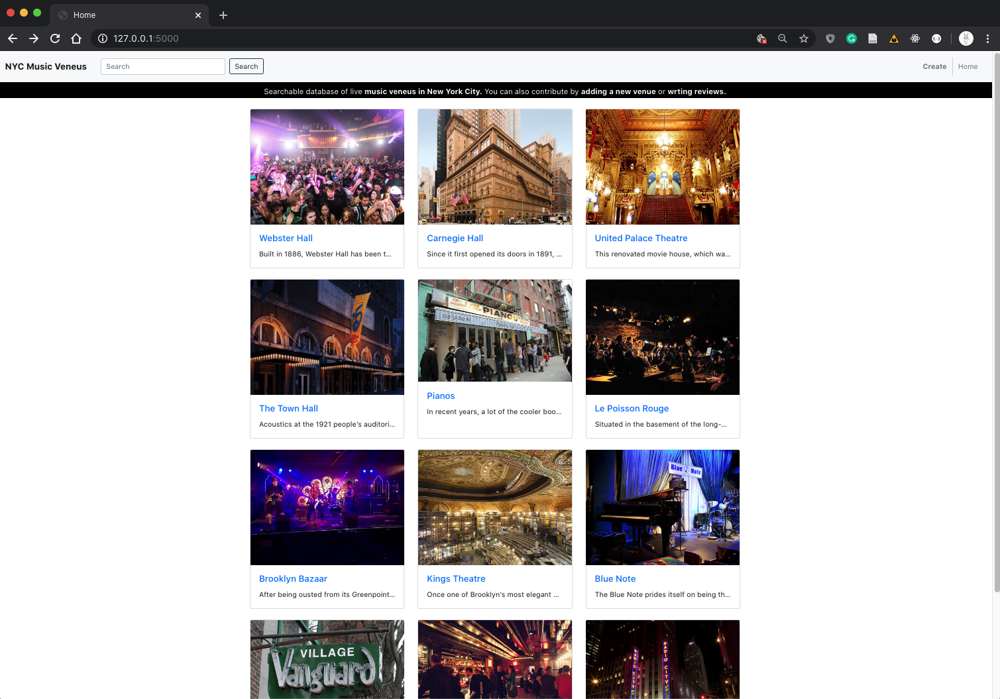
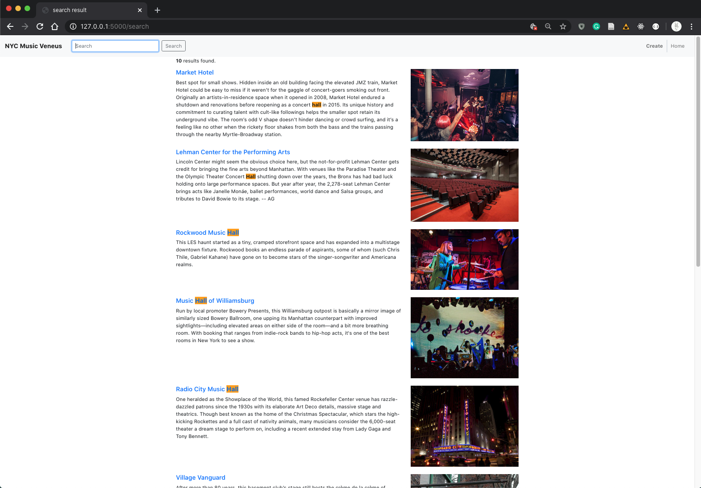
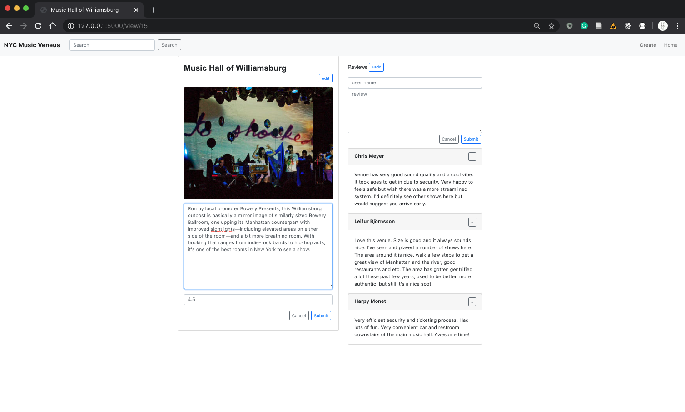
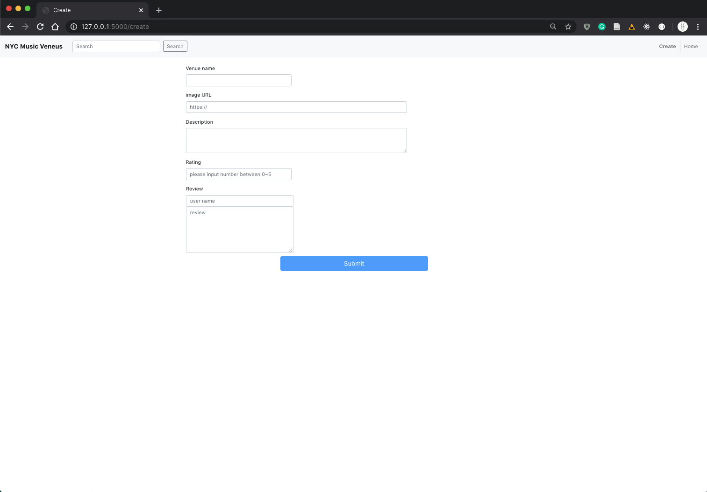

# searchable_wepApp
Full stack web site project that has highlight search functionality using Flask server and Jinja template.
db.py file serves as separate data to mimic MVC organization.

Main

Search keyword highlight functionality 

Edit data

Add new entry

